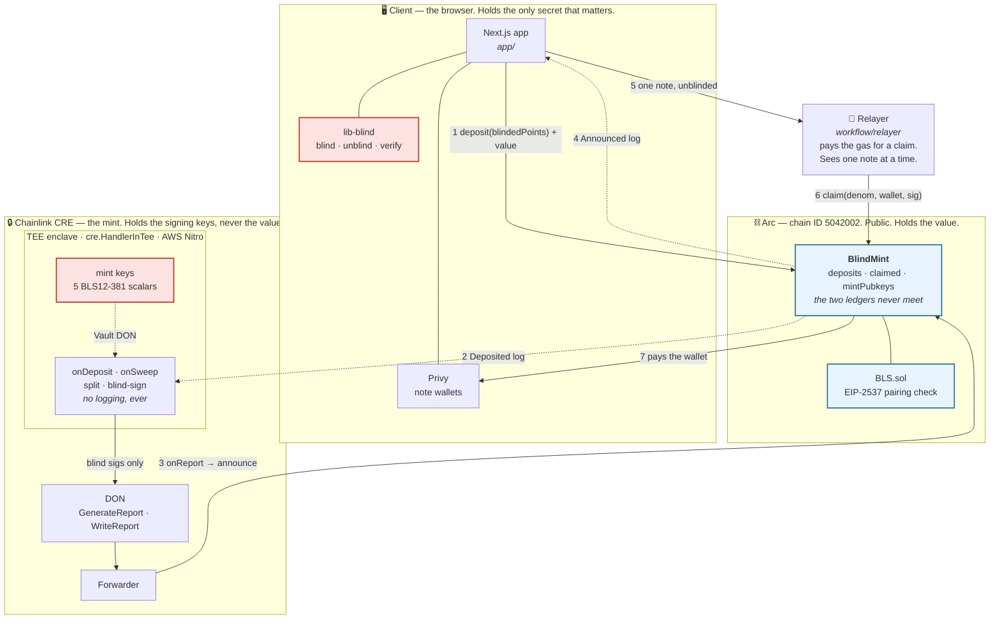
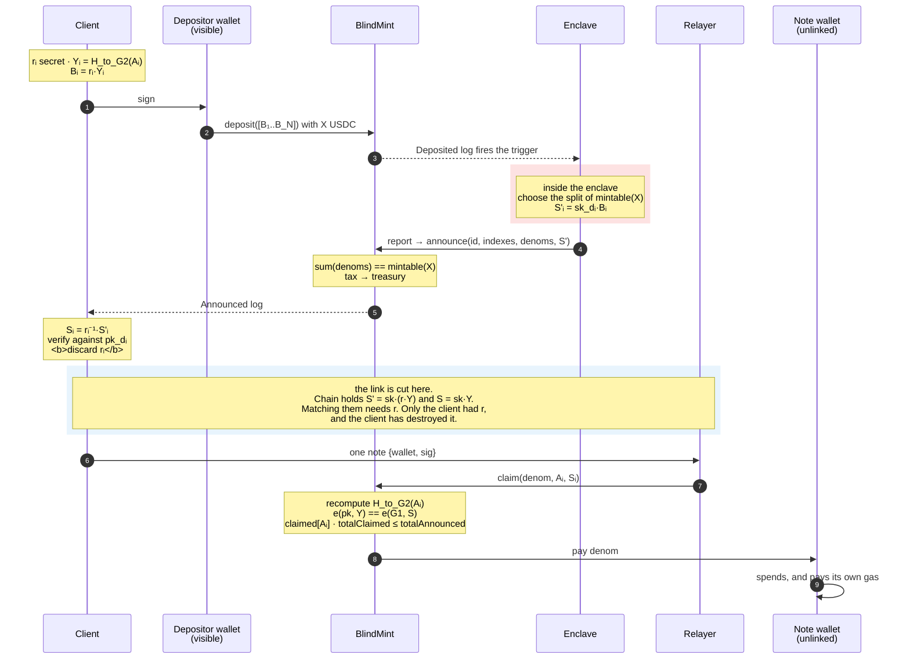
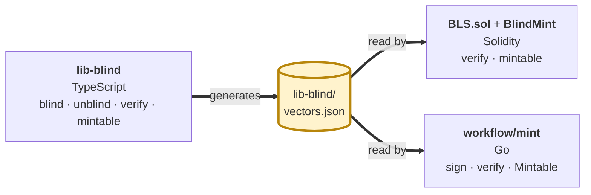

# Architecture

Four parts and one property. The parts are the client, the contract, the mint and the
relayer. The property is that no observer can tie a funded wallet to the deposit that paid
for it.

## The parts and the trust boundary

**The red boxes are the two secrets.** The mint scalars live in the enclave. The blinding
factors live in the browser and the client discards them after unblinding. Nothing else in
the system needs a long-lived secret, and no single party holds both.

**⚠️ The enclave box is the claim that is not yet demonstrated.** `cre workflow simulate`
runs the handler locally and states that it is not a real TEE. Confidential Workflows is in
private beta and this account has no deploy access. In every run so far the mint key sat in
a local file. See [the mint spec](mint-spec.md#what-is-not-demonstrated).

## The flow, and where the link is cut

The unlinkable pair is the announcement and the claim. The chain holds `S' = sk·(r·Y)` from
one and `S = sk·Y` from the other. A match between them needs `r`, and `r` no longer exists
anywhere.

On Arc the denomination is the gas token, so step 7 needs no funding transaction. That is
the reason this design works at all on Arc and would need a paymaster elsewhere.

## Why each boundary is where it is

| Boundary | What it stops |
|---|---|
| The blinding factor never leaves the browser | the mint cannot link a signature it issued to the address it pays |
| The mint holds keys and never value | a broken enclave can refuse to sign, it cannot move money |
| The contract checks `sum(denoms) == mintable(X)` | the mint cannot announce more value than the deposit holds |
| `totalClaimed <= totalAnnounced` | a mint that signs off band steals from the last honest claimant, not from the contract |
| The deposit ledger and the claim ledger share no field | there is no on-chain lookup that could rebuild the link |
| The relayer sees one note per request | a party that saw a whole batch would hold the link that blinding removed |
| The depositor never sends the claim | a depositor who claimed would put the deposit and the note in one history |

## The three implementations that must agree

`vectors.json` is the contract between the three. Change any cryptography and regenerate
it, then run all three suites.

A disagreement between off-chain unblinding and on-chain verification shows up nowhere
else. A disagreement on `mintable` makes every announcement revert with `SumMismatch`, and
that is the only symptom.

## Where each piece lives

| Part | Path | Language |
|---|---|---|
| Blind signature library and the ladder | `lib-blind/` | TypeScript |
| Contract and the pairing check | `contracts/src/` | Solidity |
| CRE workflow, the mint and the encoding | `workflow/blindmint`, `workflow/mint`, `workflow/announce` | Go, wasip1 |
| Claim relayer | `workflow/relayer` | Go |
| Wallet frontend | `app/` | TypeScript, Next.js |
| Command line client | `cli/` | TypeScript |

Specs for each: [contract](contract-spec.md) · [mint](mint-spec.md) ·
[relayer](relayer-spec.md) · [frontend](frontend-spec.md).
